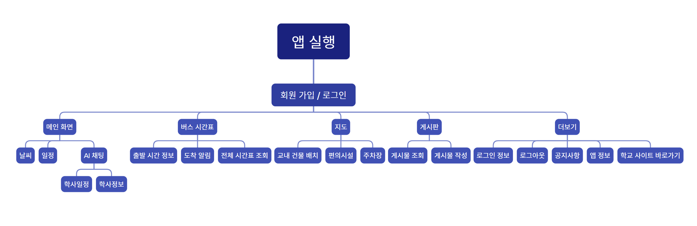
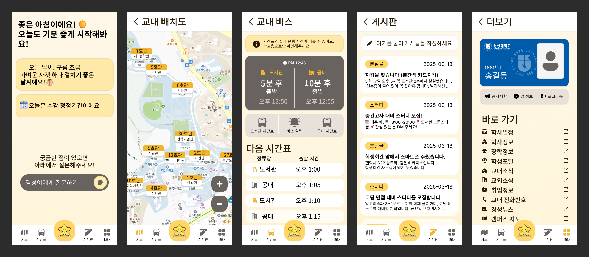

# 2주차 - 시스템 설계 및 UI/UX 디자인

## 개요
앱의 디자인을 구성하는 작업을 진행하였습니다. 사용자의 편의성과 접근성을 고려하여 컬러 팔레트를 정의하고, 정보 구조도를 작성하였으며, 최종적으로 프로토타입을 제작하였습니다.

## 활동 내용

### 정보 구조도 작성
- 사용자 경험(UX)을 고려한 앱 내 정보 구조 설계
- 화면 간 이동 경로 및 내비게이션 체계 정리

### 컬러 팔레트 정의
- 학교 로고에서 추출한 색상을 기반으로 컬러 팔레트 선정
- 기본 색상(primary), 보조 색상(secondary), 강조 색상(accent) 등을 구체화

### 프로토타입 제작
- 정보 구조도를 기반으로 프로토타입 제작
- 사용자 상호작용을 고려한 UI 구성 요소 배치

  [Figma](https://www.figma.com/design/CWtoHKFpdZyaD5XMPkcIpj/25-1_Capstone-Design)