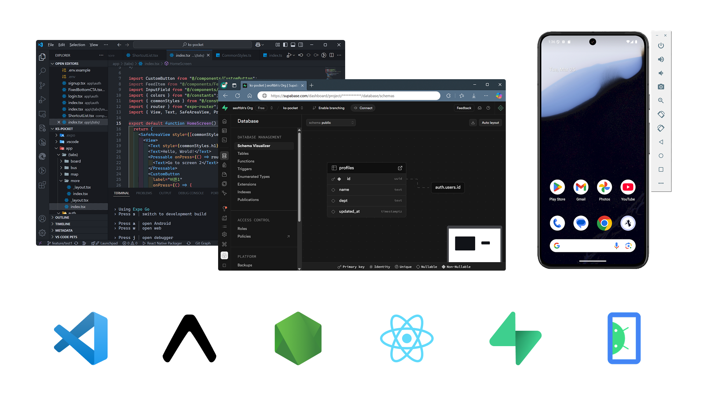
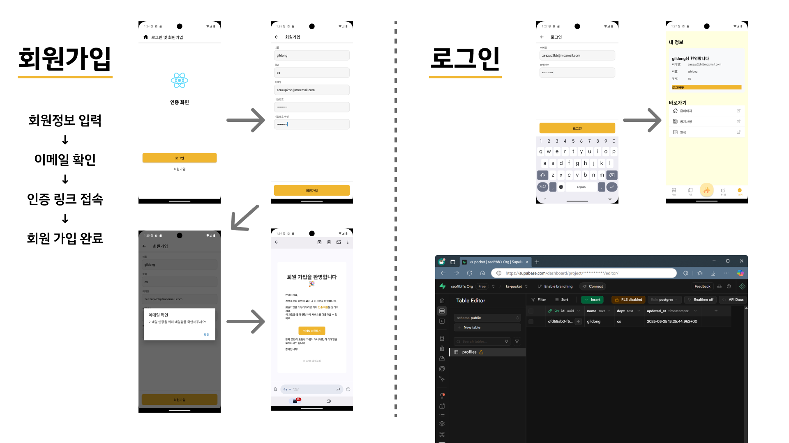

# 3주차 - 개발 환경 구축 및 DB 연동

## 개요
개발 환경을 구축하고 데이터베이스 연동을 통해 로그인 인증 기능을 구현하였습니다. 또한 기본적인 UI 컴포넌트를 설계하고 화면 간 이동 흐름을 구성하였습니다.

## 활동 내용

### 1. 개발 환경 구축
- Node.js 및 npm을 사용한 패키지 설치
- Expo 기반의 React Native 프로젝트 생성
- 안드로이드 에뮬레이터 연동 설정 완료

### 2. 기본 UI 구현
- Tabbar, 버튼, 인풋박스 등 주요 UI 컴포넌트 구현
- React Router를 활용한 화면 간 이동 흐름 구성

### 3. DB 연동 로그인 인증 구현
- 리액트 네이티브 앱과 Supabase 연동 완료
- 회원 가입 시 사용자 정보가 DB의 테이블에 저장되도록 처리
- 이메일 인증 절차를 통한 회원 가입 인증 기능 구현

## 결과 및 성과
- 앱의 초기 개발 환경이 안정적으로 구축됨
- 사용자 인터페이스의 기본 틀이 완성되어 향후 개발 속도 향상 기대
- DB 연동 및 인증 기능 구현으로 실사용 가능한 로그인 흐름 완성