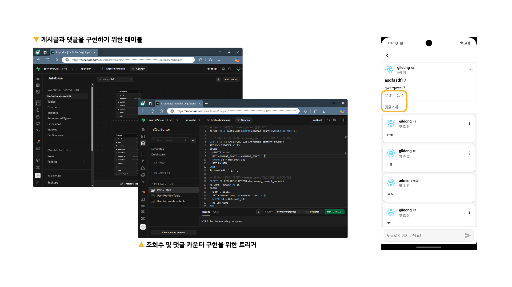
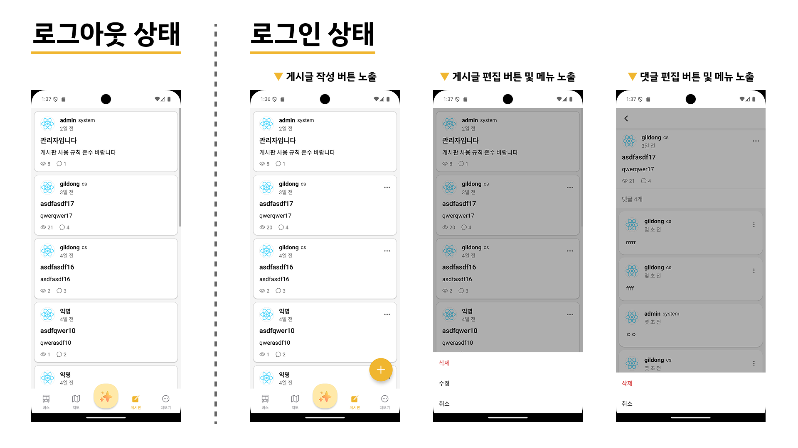

# 4주차 - UI 개선 및 게시판 기능 확장

## 개요
사용자 인터페이스 개선과 게시판 기능 구현을 중심으로 개발을 진행하였습니다. 커스텀 탭바 적용, 게시판 기능 확장, 그리고 사용자 경험 강화를 위한 다양한 요소들을 구현하였습니다.

## 활동 내용

### 1. 커스텀 탭바 적용
- 앱 최초 실행 시 표시되는 페이지를 제어하기 위해 커스텀 탭바 제작 및 적용
- 기본 제공되는 탭바를 대체하여 UX 개선

### 2. 로그인 시 사용자 피드백 개선
- 로그인 성공 시 사용자에게 환영 토스트 메시지 출력 기능 구현

### 3. 게시판 기능 확장
- 게시판 페이지에 새 글 작성 버튼 추가
- Supabase DB 연동을 통해 게시물 작성 및 조회 기능 구현
    - 게시물 수정 및 삭제 기능 구현
    - 게시글 댓글 작성 기능 추가
- 게시글 조회수 및 댓글 수 카운터 기능 구현
    - Supabase에 트리거를 추가하여 게시글 조회수 증가 기능 구현
- 게시글 목록을 당겨서 새로고침(Pull-to-Refresh) 구현

### 4. 사용자 상태 기반 UI 제어
- Supabase의 Auth를 활용
- 로그인 상태일 때만 다음 기능 활성화:
    - 글 작성 버튼
    - 게시글 메뉴(수정/삭제)
    - 댓글 메뉴(삭제)

## 결과 및 성과
- 커스텀 탭바를 적용하여 앱의 전반적인 UX 개선
- 게시판 기능의 핵심 요소인 게시글 및 댓글 시스템 구현
- 사용자 인증 상태에 따른 기능 제어로 보안성과 편의성 강화