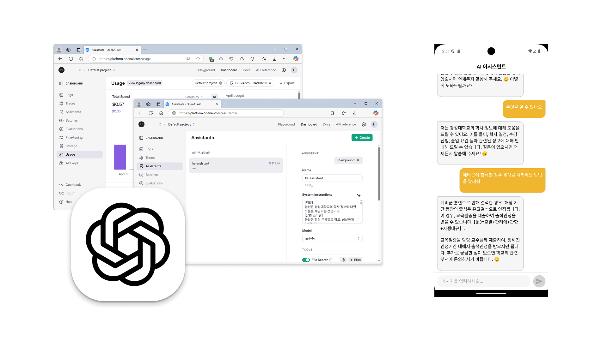
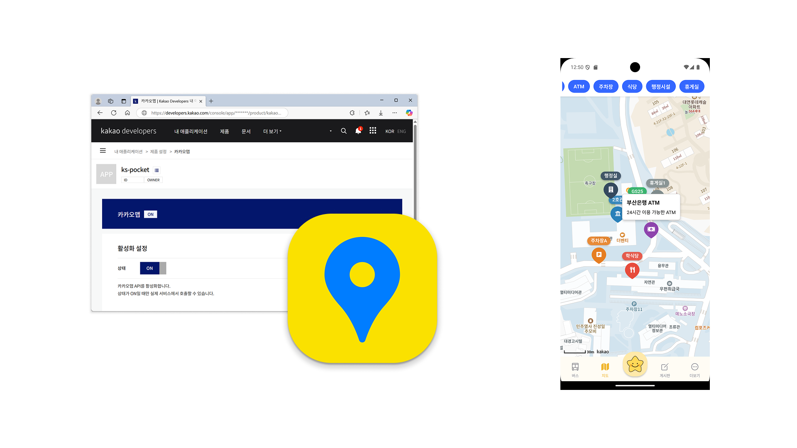

# 5주차 - AI 챗봇 및 교내 지도 기능 구현

## 개요
AI 챗봇 서비스 기능과 교내 지도 기능을 구현하였습니다. 사용자 편의성을 높이고, 학사 정보 접근성을 향상시키기 위해 다양한 기능을 개발하였습니다.

## 활동 내용
### 1. AI 챗봇 기능 구현
- 학사 정보에 대한 질문과 답변을 얻을 수 있는 AI 상담원 서비스 구현
- OpenAI API를 연동하여 기능 통합
- 채팅 기반 UI 적용으로 사용자 편의성 향상
- AI 맞춤 지침을 구성하여 자연스러운 어조와 학교 맞춤형 답변 문구 구현
- 관련 학사 정보를 수집하고 가공하여 AI 답변에 반영해 보다 정확한 답변 제공

### 2. 교내 지도 기능 구현
- Kakao Map API를 활용하여 교내 지도 기능 구현
- 교내 건물 및 편의 시설 표시
- 카테고리별 마커 표시/숨김 토글 기능 구현으로 가독성 및 사용자 선택 편의성 강화

## 향후 계획
- 챗봇 UI 개선
- 챗봇 답변용 자료 추가 수집 및 반영
- 지도에 교내 시설 추가 표시