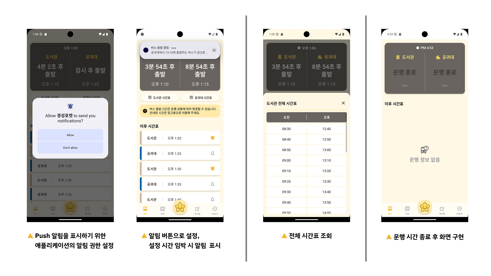
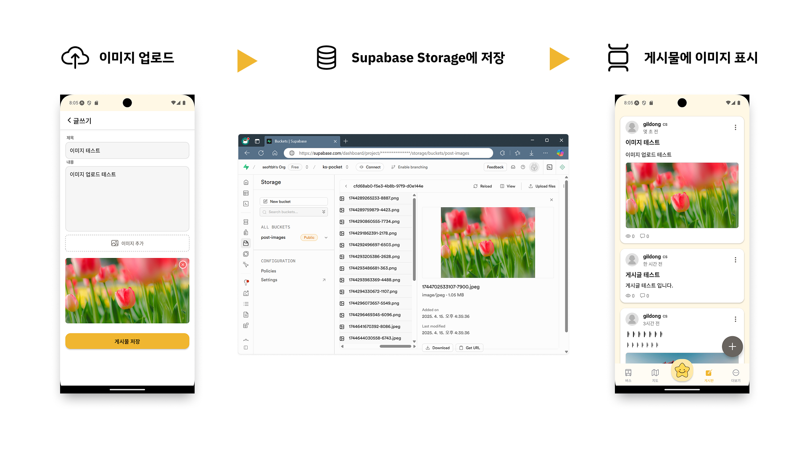

# 6주차 - 버스 시간표, UI 개선, 게시글 이미지 첨부 기능 구현

## 개요
버스 시간표 기능, UI 디자인 개선, 그리고 게시글 이미지 첨부 기능을 중심으로 개발을 진행하였습니다. 사용자의 편의성과 정보 전달의 명확성을 높이는 데 중점을 두어 기능을 구현하였습니다.

## 활동 내용
### 1. 버스 시간표 기능 구현
- 시간표 데이터를 기반으로 출발까지 남은 시간을 표시하는 기능 구현
- 현재 시간 이후의 버스 시간만 필터링하여 목록으로 제공
- push 알림을 통해 버스 출발 임박 시 사용자에게 알림 기능 제공

### 2 UI 개선 작업
- 앱의 전반적인 화면 요소 조정으로 디자인 일관성 확보
- 여백, 컴포넌트 크기, 색상 등의 스타일을 통일하여 가독성과 사용 편의성 향상

### 3 게시글 이미지 첨부 기능 구현
- 게시글 작성 시 이미지 파일을 함께 업로드 가능하도록 기능 추가
- Supabase의 Storage 기능과 연동하여 이미지 저장 및 불러오기 처리
- 게시글 목록 및 상세페이지에서 첨부된 이미지 확인 가능하도록 UI 구성

## 결과 및 성과
- 버스 시간표 및 알림 기능을 통해 사용 편의성 향상
- UI 개선으로 앱의 전반적인 사용자 경험(UX) 향상
- 이미지 첨부 기능 추가로 게시글의 정보 전달력 강화