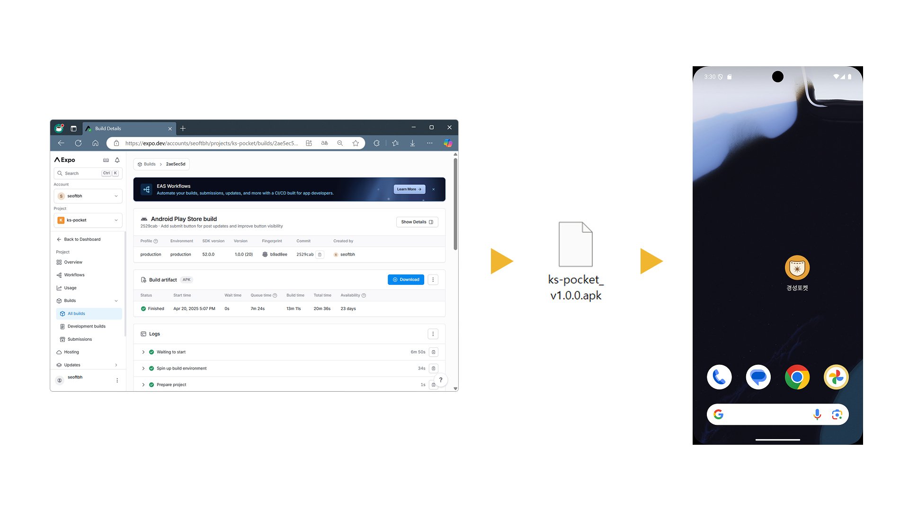

# 7주차 - 최종 점검 및 앱 빌드

## 개요
프로젝트의 마무리 단계로, 전체 기능에 대한 최종 점검을 수행하고 앱을 빌드하여 실제 기기에서 테스트를 진행하였습니다.

## 활동 내용
### 1. 최종 기능 점검
- 앱에 포함된 모든 기능에 대한 동작 여부를 점검
- UI 흐름, 로그인 및 게시판 기능, 지도 및 챗봇 기능 등 전반적인 기능 테스트 수행

### 2. 앱 빌드
- 프로젝트를 최종 배포 가능한 상태로 빌드
- 앱 아이콘 적용, 스플래시 화면 등 최종 빌드 요소 점검 및 설정
- Expo를 활용하여 Android용 설치 파일(.apk) 생성

### 3. 네이티브 기기 테스트
- 실제 Android 기기에 설치하여 실행 테스트 진행
- 화면 비율, 반응성, 기능 연동 상태 등을 실제 환경에서 검증

